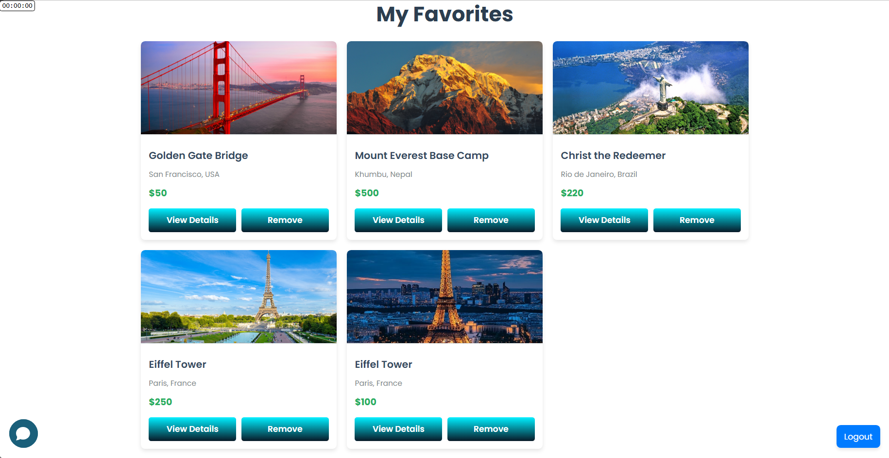
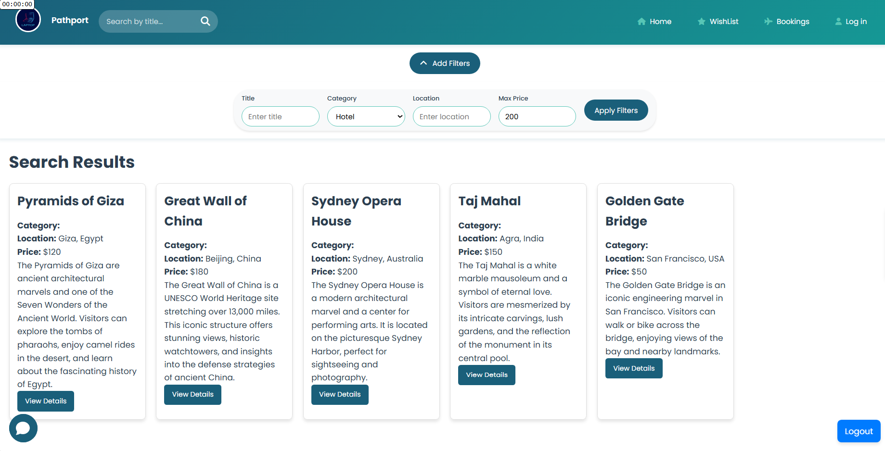

<h1 align="center">
  <br>  
  <a href=""></a>
  <br>
  PathPort
  <br>
</h1>

<h4 align="center">A travel website offering destination browsing, filters, reviews, bookings, discussion forums, favorites, and admin management with chatbot support.</h4>

<!-- <p align="center">
  <a href="https://badge.fury.io/js/electron-markdownify">
    
  </a>
  <a href="https://gitter.im/amitmerchant1990/electron-markdownify"></a>
  <a href="https://saythanks.io/to/bullredeyes@gmail.com">
      
  </a>
  <a href="https://www.paypal.me/AmitMerchant">
    
  </a>
</p> -->

<p align="center">
  <a href="#key-features">Key Features</a> •
  <a href="#how-to-use">How To Use</a> •
  <a href="#dependencies">Dependencies</a> •
  <a href="#app-design">App Design</a> •
  <a href="#future-features">Future Features</a> •
  <a href="#documentation">Documentation</a> •
  <a href="#contact">Contact</a> •
  <a href="#license">License</a> •
  <a href="#acknowledgements">Acknowledgements</a>
</p>

<!--  -->

---

## Key Features

1. **User & Admin Sign-In/Sign-Up**: Secure authentication for users and administrators.
2. **Filters**: Search destinations by location, price, activity, and ratings.
3. **Search Functionality**: Find destinations instantly by name.
4. **Destination Pages**: Detailed info, reviews, events, and forums for each destination.
5. **Discussion Forums**: Nested comments and voting for user interaction.
6. **Favorites**: Save preferred destinations to your profile.
7. **Booking System**: Integrated interface with confirmation and booking history.
8. **Chatbot Support**: Real-time user assistance.
9. **Admin Management**: Add/edit/delete destinations, manage user reports, and oversee site content.

---

## How To Use

# How to Run the Project

Follow these steps to clone the repository and run the necessary scripts for your operating system.

Note: The project requires Node.js, npm, and Java to be installed on your machine.

### 1. Clone the Repository

First, clone the repository to your local machine:

```
git clone https://github.com/mohassan5286/Software-Engineering
cd Software-Engineering
```

---

### 2. Run the Script Based on Your Operating System

The `scripts/` folder contains the setup scripts for different operating systems. Choose the appropriate script for your platform.

### For Linux/macOS (Bash)

1. Navigate to the `scripts` folder:

```
cd scripts
```

2. Make the scripts executable:

```
chmod +x run_project_linux.sh
```

1. Run the script:

```
./run_project_linux.sh
```
### For Windows (Batch Script)

1. Navigate to the `scripts` folder.

2. Double-click the `run_project_windows.bat` file to execute the script.

---

### What These Scripts Do:

- **Frontend**: Installs dependencies using `npm` and starts the frontend server.
- **Backend**: Runs the backend application using Java with `java -jar backend.jar`.

- backend runs on localhost:8081
- frontend runs on localhost:3000

---

## Dependencies

- [React](https://reactjs.org/)
- [Spring Boot](https://spring.io/projects/spring-boot)
- [MongoDB](https://www.mongodb.com/)

---

## App Design

- Login/Signup Page
  
  
- Home Page
  
  
- Destination Page
  
- Wishlist Page
  
- Filters
  
- Add New Destination
  
  
- Chatbot
  
- Booking Page
  

---

## Future Features

1. **Personalized Recommendations**: Suggest destinations based on user preferences and browsing history.
2. **Interactive Maps**: Display destinations with a map interface for easy navigation.
3. **Multi-Language Support**: Provide content in multiple languages for global accessibility.
4. **Dynamic Event Updates**: Real-time updates for events and festivals at destinations.
5. **Social Sharing**: Allow users to share destinations and experiences on social media.
6. **Augmented Reality Previews**: Visualize destinations through AR to enhance user engagement.
7. **Group Bookings**: Enable booking for groups with shared itineraries and discounts.
8. **Push Notifications**: Notify users about deals, updates, and personalized recommendations.
9. **Travel Insurance Integration**: Offer optional travel insurance during the booking process.
10. **Offline Access**: Save destination details and itineraries for offline use.

---

## Documentation

Design Detials can be found in the [docs](docs/designPhase.pdf) folder.

---

## Contact

1. [**Mohamed Hassan**](https://github.com/mohassan5286)
2. [**Omar Hany**](https://github.com/OmarHani4306)
3. [**Ahemd Dewdar**](https://github.com/a7meddewe4)
4. [**Mohamed A Fahrat**](https://github.com/mohamedafarhat)
5. [**Ahmed Samir**](https://github.com/ahmedshepl4242)
6. [**Mohamed Mohamed Ibrahim**](https://github.com/Mohamed-Mohamed-Ibrahim)

---

## License

[MIT License](LICENSE)

---

## Acknowledgements

- This project was developed as part of the Software Engineering course at the Alexandria University in Alexandria, Egypt.
- Special thanks to our professor and teaching assistant for their guidance and support.
- Course Instructor:
  - Prof: Dr. Noha Adly 
  - Teaching Assistant: Eng. Ahmed El Naggar